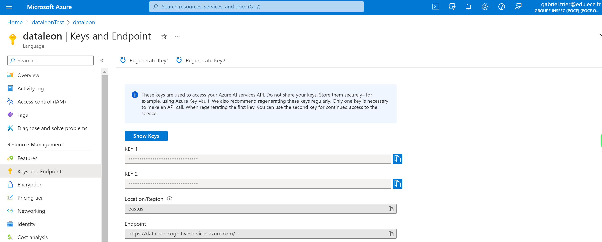
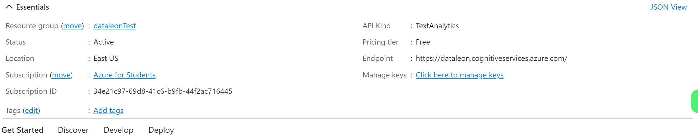
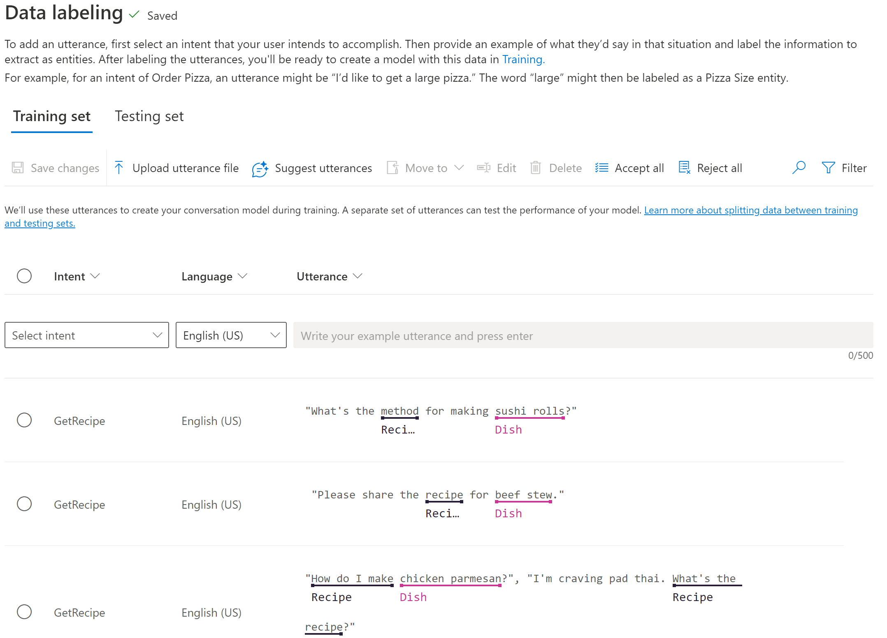
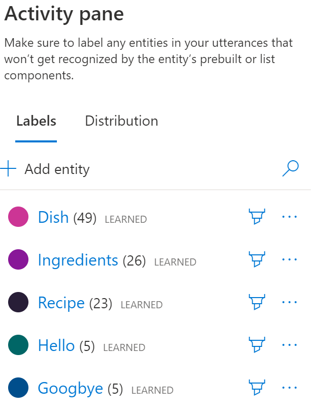
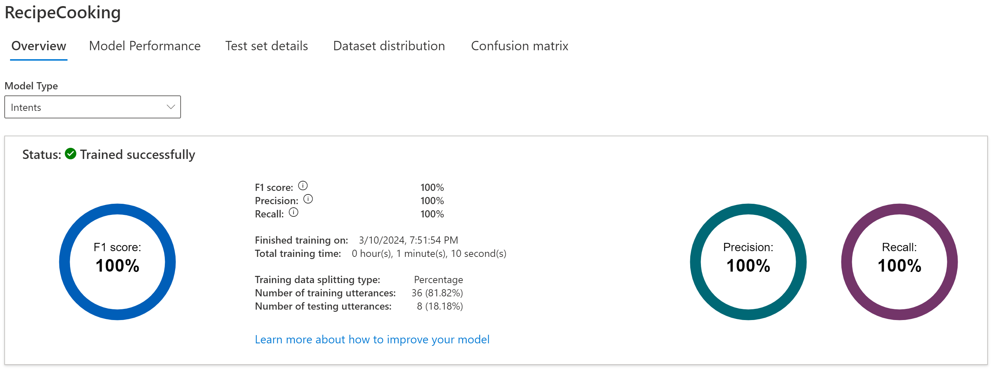
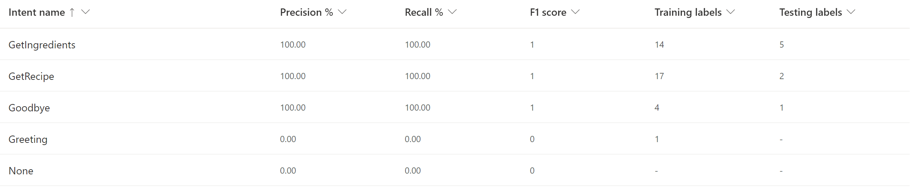
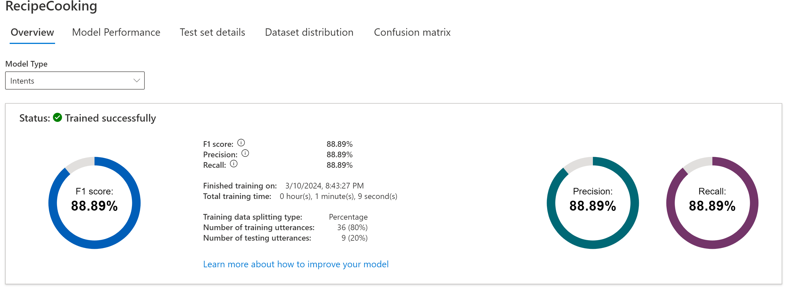
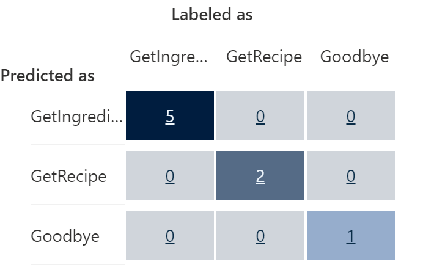
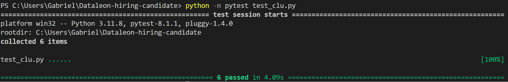

# Test-Hiring-candidate

## Functionality
I created a CLU projet on Azure AI studio that is able to understand the intents of an user. In my case I decided that the intents could be about:

- Getting ingredients 
- Getting Recipe
- Saying Hello or Goodbye

In order to do this I needed to:
1. Create a language project on Azure
2. Setting up the proper region and type of language project
3. Defining the intents and the entities to help my model learn quicker
4. Providing utterance as an example of what my user could say
5. Training and deploying the model 
6. Linking it with python code to get the intents from a CLU class 
7. Testing the results

## Steps 

### 1. Creating Azure account and getting API key

Since I had no LUIS resource created beforehand and that since April 2023 we are no longer able to create new LUIS resources, I had to create a new Language resource in the Azure portal.

This new resource needed to be assigned to the US region since some regions do not have access to the full authoring and prediction.

After this step done, I was able to create a new project using the Azure resource that I had just created and obtained my API key to make API calls. 

To conclude I'am working with a Conversational Language Understanding (CLU) project in Azure. 

### 2. Setting project properly

In order to have a good model that doesn't do too mush overfitting nor underfitting it is necessary to provide a lot of data for training and test sets and keep the split around 80/20. 

For this I labeled data and provide utterances:

Also I created entities such as dish, ingredients, recipe, hello and goodbye:

From the test we could observe the performance of the model :

With a test score of 1 we can maybe observe that the model ids overfitting that is why it is necessary to add even more data so the modle doesn't learn all the test and training and will than perform poorly on new data!

We can aslo see the confusion matrix :

After we can deploy our project!

### 3. Creating the CLU Class

The `CLUClient` class is used to interact with the Azure CLU API. It has a method `get_intent` which takes a query as input and returns the top intent predicted by the CLU model.

Based on the prediction URL and the smaple request rpovided as an example on Azure I was able to determine the parameters needed to connect properly (headers, data).

### 4. Pytest file 

The `test_clu.py` file contains unit tests for the `CLUClient` class. It uses the `pytest` framework for testing.

To run the tests, you need to have `pytest` installed. If it's not installed, you can install it using pip:
    `pip install pytest`

Then you can run the tests using the following command:
    `python -m pytest test_clu.py` 

## Images folder
Please note that there is an image folder for more information and proof of what I did! Thank you.

## Author
- Gabriel Trier 